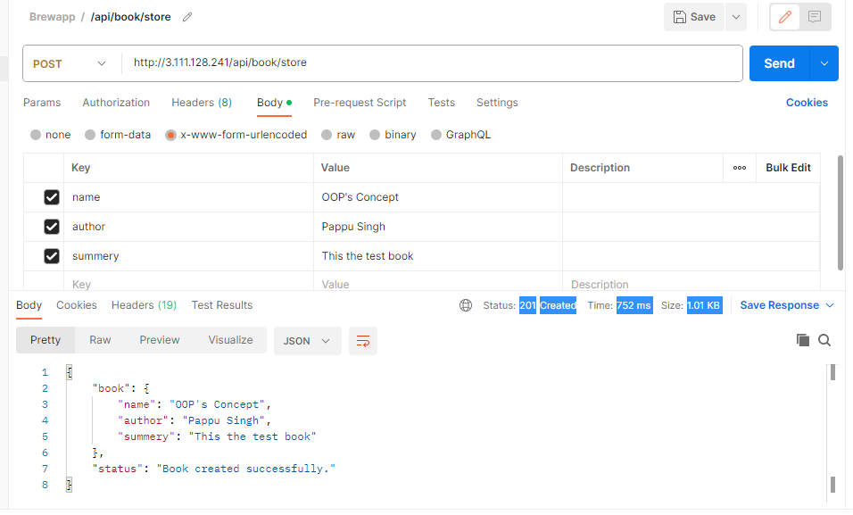

# brewapps
Node.js Backend Developer Challenge

# Getting started
- Clone the repository
```
git clone https://github.com/singhpappu/brewapps.git
```
- Install dependencies
```
cd brewapps
npm install
```
- Configure your mongoDB server or use MongoDB Atlas 

```bash
Rename the .env.example to .env and add your DATABASE Connection url 
```
- Build and run the project
```
npm run build
npm start
```
Note: I have used the Prisma ORM Client for database connection, if installation trigger error due to prisma try to follow the Prisma docs.(https://www.prisma.io/docs/concepts/database-connectors/mongodb)  

Finally, nodejs server will start on `http://localhost:7000`

- I have deployed the API to AWS EC2 instance and it is working on http://3.111.128.241

```
CRUD API
1. POST: /api/book/store --> Store the book

2. GET: /api/books  --> Book listing
3. GET: /api/book/<book_id> --> Fetch Book detail by book id
4. DELETE: /api/book/<book_id> --> Delete book by book id
```
